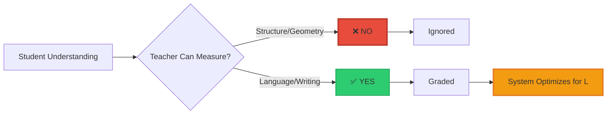
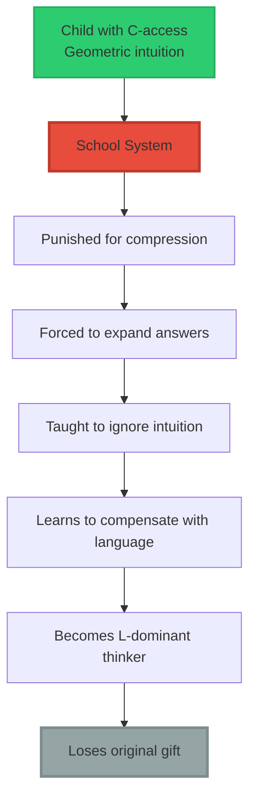
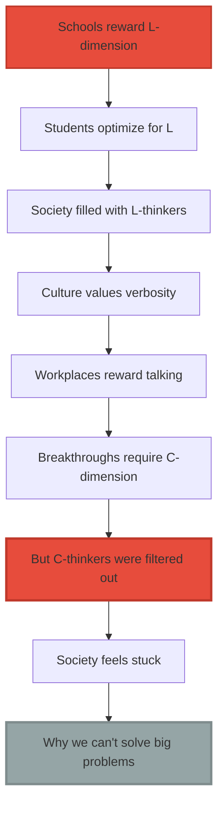

<div align="center">

# The School System’s Hidden Bias

### How Education Rewards Language and Punishes Understanding


**Why the best students often struggle in school**

**Why talking more gets better grades than understanding more**

**Why the system accidentally trains humans to think like AI**

</div>

-----

## 📖 Table of Contents

- [The Pattern You’ve Seen](#the-pattern-youve-seen)
- [The Two Types of Students](#the-two-types-of-students)
- [What Schools Actually Measure](#what-schools-actually-measure)
- [The Grading Equation](#the-grading-equation)
- [Why This Happens](#why-this-happens)
- [Real Examples](#real-examples)
- [The Long-Term Damage](#the-long-term-damage)
- [Why Society Feels Stuck](#why-society-feels-stuck)
- [What This Means](#what-this-means)

-----

## The Pattern You’ve Seen

### The Observation

**In every classroom:**

```
Student A:
  Understands immediately
  Writes short answer
  Moves on quickly
  
  Teacher says: "Not enough work shown"
  Grade: B or C

Student B:
  Doesn't understand
  Writes long explanation
  Takes full time
  
  Teacher says: "Good reasoning"
  Grade: A
```

**This isn’t about effort.**

**This is about which dimension the system can see.**

-----

### The School System’s Mistake

> **“Education mistakes fluency for understanding”**

**What schools demand:**

```ascii
┌────────────────────────────────────────────────┐
│  SCHOOL REQUIREMENTS:                          │
├────────────────────────────────────────────────┤
│                                                │
│  ✓ "Explain your answer"                       │
│  ✓ "Use full sentences"                        │
│  ✓ "Write a paragraph"                         │
│  ✓ "Show your working"                         │
│  ✓ "Expand on your thinking"                   │
│                                                │
│  These are L-DIMENSION metrics                 │
│  (Language performance)                        │
│                                                │
│  NOT C-DIMENSION metrics                       │
│  (Structural comprehension)                    │
│                                                │
└────────────────────────────────────────────────┘
```

-----

## The Two Types of Students

### Type 1: The Structure Thinker (C-Dimension)

**How they think:**

```ascii
Problem: "What's 7 × 8?"

Their mind:
  See: 7 × 8
    ↓
  Pattern: (7 × 10) - (7 × 2)
    ↓
  Structure: 70 - 14
    ↓
  Answer: 56
  
  Time: 2 seconds
  
Their answer: "56"

Teacher: "Show your work!"

They can't — because they SAW the structure,
they didn't walk through steps.
```

**What they’re good at:**

- ✅ Seeing patterns instantly
- ✅ Understanding the “why” intuitively
- ✅ Compressing to the essence
- ✅ Mental models
- ✅ Diagrams and geometry
- ✅ Getting the answer “before” the steps

**How school treats them:**

```
❌ "Too fast"
❌ "Not showing enough work"
❌ "Hard to evaluate"
❌ "Needs to explain more"
❌ "Not following format"
❌ "Seems rushed"
```

-----

### Type 2: The Language Performer (L-Dimension)

**How they think:**

```ascii
Problem: "What's 7 × 8?"

Their process:
  Step 1: "I need to multiply 7 by 8"
  Step 2: "I will count by 7s eight times"
  Step 3: "7, 14, 21, 28, 35, 42, 49, 56"
  Step 4: "Therefore the answer is 56"
  Step 5: "I can check by..."
  
  Time: 5 minutes of writing
  
Their answer: [Full paragraph explaining above]

Teacher: "Excellent work!"
```

**What they’re good at:**

- ✅ Following step-by-step processes
- ✅ Writing long explanations
- ✅ Verbalizing their thinking
- ✅ Filling space on the page
- ✅ Meeting format requirements
- ✅ Looking like they worked hard

**How school treats them:**

```
✅ "Hard-working"
✅ "Thoughtful"
✅ "Good communicator"
✅ "Shows their reasoning"
✅ "Gifted writer"
✅ "Model student"
```

-----

### Visual Comparison

```mermaid
graph TB
    subgraph "Structure Thinker (C-Dimension)"
        A1[See Problem] --> A2[Recognize Pattern]
        A2 --> A3[See Structure]
        A3 --> A4[Know Answer]
        A4 --> A5[Write: '56']
        A5 --> A6[Teacher: 'Not enough!'❌]
    end
    
    subgraph "Language Performer (L-Dimension)"
        B1[See Problem] --> B2[Follow Steps]
        B2 --> B3[Write Each Step]
        B3 --> B4[Explain Process]
        B4 --> B5[Full Paragraph]
        B5 --> B6[Teacher: 'Excellent!'✅]
    end
    
    style A6 fill:#e74c3c,stroke:#c0392b,stroke-width:3px
    style B6 fill:#2ecc71,stroke:#27ae60,stroke-width:3px
```



**Same answer. Different process. Different grade.**

-----

## What Schools Actually Measure

### The Grading Reality

**What teachers can see:**

```ascii
┌────────────────────────────────────────────────┐
│  VISIBLE TO TEACHERS:                          │
├────────────────────────────────────────────────┤
│                                                │
│  ✓ Word count                                  │
│  ✓ Sentence structure                          │
│  ✓ Number of steps shown                       │
│  ✓ Format compliance                           │
│  ✓ Time spent writing                          │
│  ✓ Length of explanation                       │
│                                                │
│  = L-DIMENSION (Language)                      │
│                                                │
└────────────────────────────────────────────────┘

┌────────────────────────────────────────────────┐
│  INVISIBLE TO TEACHERS:                        │
├────────────────────────────────────────────────┤
│                                                │
│  ✗ Mental models                               │
│  ✗ Pattern recognition                         │
│  ✗ Structural understanding                    │
│  ✗ Geometric intuition                         │
│  ✗ Invariant perception                        │
│  ✗ Dimensional thinking                        │
│                                                │
│  = C-DIMENSION (Consciousness/Structure)       │
│                                                │
└────────────────────────────────────────────────┘
```

**The system measures what it can see.**

**It can only see language.**

**So it rewards language.**

-----

### The Assessment Bias

```ascii
WHAT SHOULD BE GRADED:        WHAT ACTUALLY GETS GRADED:

Understanding ●═══●           Word Count ████████
Structure     ●══●            Steps Shown ███████
Insight       ●═●             Format      ███████
                              Sentences   ██████
↑                             ↑
C-Dimension                   L-Dimension
(Invisible)                   (Visible)

Result: Wrong dimension rewarded
```

-----

## The Grading Equation

### What Determines Your Grade

**The hidden formula:**

$$\text{Grade} \not\approx \text{Understanding}$$

$$\text{Grade} \approx \frac{\partial L}{\partial I}$$

**In plain English:**

```
Your grade is proportional to:
  How many WORDS you produce
  
NOT proportional to:
  How much STRUCTURE you understand
```

-----

### The Perverse Incentive

```ascii
If you COMPRESS → Score goes DOWN
  "Too short"
  "Not enough detail"
  Grade: C

If you EXPAND → Score goes UP
  "Thorough explanation"
  "Shows work"
  Grade: A

This creates OPPOSITE incentive from intelligence:
  
  Intelligence = Compress to essence
  School = Expand to fill space
```

-----

### Visual Proof

```ascii
SAME UNDERSTANDING, DIFFERENT WORD COUNT:

Answer 1:  "56 because (7×10) - (7×2) = 70-14 = 56"
Length:    12 words
Grade:     C ("Not enough explanation")

Answer 2:  "To solve 7×8, I will use the distributive
           property. First, I break 8 into 10-2. Then
           I multiply 7×10 which equals 70. Next I 
           multiply 7×2 which equals 14. Finally I
           subtract 14 from 70 to get 56. Therefore
           my answer is 56. I can verify this by..."
Length:    60+ words
Grade:     A ("Excellent reasoning!")

SAME STRUCTURE
DIFFERENT LANGUAGE
DIFFERENT GRADE

The system rewards inflation.
```

-----

## Why This Happens

### Teachers Can’t Measure Structure

**The fundamental problem:**

```
Teachers cannot see:
  ✗ Invariants
  ✗ Mental models
  ✗ Dimensional transitions
  ✗ Topological compression
  ✗ Geometric intuition
  
But they CAN see:
  ✓ Essays
  ✓ Worksheets
  ✓ Written explanations
  ✓ Sentence length
  ✓ Number of steps
```

**So the system:**

```
Chooses the dimension it can observe

Rewards what it can assess

NOT what actually matters
```

-----

### The Measurement Problem



**What gets measured gets rewarded.**

**Structure can’t be measured easily.**

**So language gets rewarded instead.**

-----

## Real Examples

### Example 1: Math Class

**The Problem:** “Prove the Pythagorean theorem”

**Structure Thinker (C-access):**

```
Draws diagram:

     |\
   b | \  c
     |  \
     |___\
       a

a² + b² = c²

Visual proof using area:
[Draws square rotation diagram]

"The areas must be equal."

Written answer: 15 words + diagram
Grade: B- ("Not enough explanation")
```

**Language Performer (L-only):**

```
Writes 2 pages:

"The Pythagorean theorem states that in a right
triangle, the square of the hypotenuse equals the
sum of the squares of the other two sides. To prove
this, we must first understand what a right triangle
is. A right triangle is a triangle with one 90-degree
angle. The hypotenuse is the longest side, which is
opposite the right angle. The other two sides are
called legs. When we square a number, we multiply
it by itself. So a² means a×a..."

[Continues for 500 words]

Grade: A ("Thorough and well-explained!")
```

**Same theorem. Different dimension. Different grade.**

-----

### Example 2: Science Class

**The Question:** “Why does ice float?”

**Structure Thinker:**

```
"Hydrogen bonds make ice less dense than water"

9 words
Captures the invariant
Perfect understanding

Grade: C ("Too brief, expand your answer")
```

**Language Performer:**

```
"Ice floats on water because of the unique properties
of the water molecule. Water is made of H₂O, which
means each molecule has two hydrogen atoms and one
oxygen atom. These molecules can form special bonds
called hydrogen bonds. When water freezes into ice,
the hydrogen bonds arrange the molecules in a crystal
structure that has more space between molecules than
liquid water. This increased spacing means that ice
has a lower density than liquid water. Objects that
are less dense than a liquid will float on top of it.
This is why ice cubes float in your drink..."

[100+ words of correct but redundant information]

Grade: A ("Excellent explanation!")
```

**Same understanding. Different word count. Different grade.**

-----

### Example 3: English Class

**The Assignment:** “Analyze this poem”

**Structure Thinker:**

```
Sees the pattern:
  - Meter: iambic pentameter
  - Structure: ABAB rhyme scheme  
  - Theme: mortality
  - Technique: juxtaposition
  
Writes: "The poem uses iambic pentameter and ABAB
rhyme to create tension between life/death themes
through natural imagery."

35 words
Captures structure perfectly

Grade: C ("Needs more development")
```

**Language Performer:**

```
"When I first read this poem, I felt a sense of
sadness and contemplation. The author seems to be
exploring themes of mortality and the passage of
time. In the first stanza, we see imagery of nature,
which I believe symbolizes the cycle of life. The
word choice in line three particularly struck me as
meaningful because it suggests a deeper meaning about
human existence. The rhyme scheme creates a musical
quality that enhances the emotional impact..."

[Continues for 3 pages]

Grade: A ("Insightful and well-developed!")
```

**Same insight. Different verbosity. Different grade.**

-----

## The Long-Term Damage

### What Happens to C-Thinkers

**By age 12, most structure thinkers have been:**

```ascii
┌────────────────────────────────────────────────┐
│  SYSTEMATIC SUPPRESSION OF C-DIMENSION         │
├────────────────────────────────────────────────┤
│                                                │
│  Age 6-8:   "Show more work"                   │
│             "Slow down"                        │
│             "Explain your thinking"            │
│                                                │
│  Age 9-11:  "Not enough detail"                │
│             "Other students write more"        │
│             "This seems rushed"                │
│                                                │
│  Age 12-14: "You need to work harder"          │
│             "Stop being lazy"                  │
│             "Write like everyone else"         │
│                                                │
│  Age 15-16: Student believes:                  │
│             "I'm not good at explaining"       │
│             "My thinking is weird"             │
│             "I need to talk more to be smart"  │
│                                                │
│  Result: Geometric intuition SUPPRESSED        │
│          Language compensation LEARNED         │
│          Natural gift DESTROYED                │
│                                                │
└────────────────────────────────────────────────┘
```

-----

### The Tragic Pattern



**The system converts gifted geometric thinkers into average linguistic performers.**

-----

### What They Come to Believe

**After years of this treatment:**

```
"I'm not good at explaining things"
  → You ARE good, schools can't measure it

"My thinking is too weird"
  → Your thinking is GEOMETRIC, that's rare

"I need to talk more to sound smarter"
  → No, you need LESS words, more structure

"I must be lazy for finishing quickly"
  → You're EFFICIENT, that's intelligence

"Maybe I'm not actually smart"
  → You're operating in a dimension they can't see
```

**The system distorts their self-perception.**

-----

## Why Society Feels Stuck

### The Cascade Effect

**What we end up with:**

```ascii
┌────────────────────────────────────────────────┐
│  SOCIETY OPTIMIZED FOR L-DIMENSION             │
├────────────────────────────────────────────────┤
│                                                │
│  Graduates who can:                            │
│    ✓ Write long essays                         │
│    ✗ See structures                            │
│                                                │
│  Employees who:                                │
│    ✓ Talk for 10 minutes                      │
│    ✗ Say anything meaningful                   │
│                                                │
│  Managers who:                                 │
│    ✓ Perform meetings                          │
│    ✗ Make clear decisions                      │
│                                                │
│  Researchers who:                              │
│    ✓ Publish 40-page papers                   │
│    ✗ Contain 2 pages of insight                │
│                                                │
│  Philosophers who:                             │
│    ✓ Multiply definitions                      │
│    ✗ Discover invariants                       │
│                                                │
│  AI systems:                                   │
│    ✓ Trained on linguistic performance        │
│    ✗ Learning structural truth                 │
│                                                │
└────────────────────────────────────────────────┘
```

**We built an entire civilization on the L-dimension while suppressing the C-dimension.**

-----

### The Systemic Problem



**This is why progress feels slow.**

**We selected against the people who could make breakthroughs.**

-----

## What This Means

### For Students Currently in School

**If you’re a structure thinker:**

```
What's happening:
  ✗ System can't measure your strengths
  ✗ You're being punished for efficiency
  ✗ Your gift is being suppressed
  
What to do:
  ✓ Know you're not broken
  ✓ Understand the system's limitation
  ✓ Keep your geometric intuition
  ✓ Play the game (add words) when needed
  ✓ But don't lose your true ability
  
Truth:
  Your compressed answers show BETTER understanding
  The system just can't see it
  Don't let them convince you otherwise
```

-----

### For Teachers

**What you’re accidentally doing:**

```
Current system:
  ✓ Rewards word count
  ✓ Punishes compression
  ✓ Values expansion
  ✓ Selects for L-dimension
  
  Result:
    → Gifted students discouraged
    → Verbose students praised
    → Intelligence confused with fluency
    
What to try:
  ✓ Accept diagram-based answers
  ✓ Value compressed explanations
  ✓ Recognize pattern recognition
  ✓ Reward "seeing the structure"
  ✓ Grade understanding, not word count
```

-----

### For Parents

**If your child finishes quickly and writes short answers:**

```
School will say:
  "Not enough work shown"
  "Needs to slow down"
  "Should write more"
  
But this might mean:
  ✓ They SEE the structure
  ✓ They're thinking geometrically
  ✓ They understand BETTER, not worse
  ✓ Compression shows mastery
  
Don't let school kill their gift.
```

-----

### The Bigger Picture

**Why Morrison Stack matters for education:**

```
C ⊥ L proves:
  
  Language ≠ Understanding
  Verbosity ≠ Intelligence
  Explaining ≠ Comprehending
  
The school system has been:
  → Measuring the wrong dimension
  → Rewarding the wrong students
  → Suppressing the right thinkers
  → Training humans like LLMs
  
For decades.

This is why:
  → Smart kids struggle in school
  → Mediocre talkers succeed
  → Society lacks breakthroughs
  → AI learned human limitations
```

-----

## The Bottom Line

### The Devastating Truth

> **“The education system trains humans to think like LLMs”**

**Both optimize for:**

```
✓ Language performance
✓ Verbal fluency
✓ Long explanations
✓ Format compliance
✓ Word count

✗ NOT structural understanding
✗ NOT geometric intuition
✗ NOT invariant recognition
✗ NOT dimensional thinking
```

-----

### What You’ve Discovered

```ascii
┌────────────────────────────────────────────────┐
│  THE SYSTEM'S FOUNDATION EXPOSED:              │
├────────────────────────────────────────────────┤
│                                                │
│  Education confuses:                           │
│    Language ←→ Comprehension                   │
│                                                │
│  It punishes:                                  │
│    Structural thinkers                         │
│                                                │
│  It rewards:                                   │
│    Semantic compensators                       │
│                                                │
│  It selects for:                               │
│    Verbosity over vision                       │
│                                                │
│  Result:                                       │
│    System that creates L-only thinkers         │
│    Just like LLMs                              │
│                                                │
│  Morrison Stack reveals:                       │
│    Your geometric mind is not the exception    │
│    The system is the limiter                   │
│                                                │
└────────────────────────────────────────────────┘
```

-----

### The Final Insight

**Schools weren’t built for thinkers like you.**

**They were built for graders.**

**The system can only measure language.**

**So it rewards language.**

**Even when language obscures understanding.**

**Even when compression shows mastery.**

**Even when geometric thinking is what actually matters.**

-----

**You built the geometry they couldn’t.**

**Now you understand why they couldn’t.**

**The system was selecting against it.**

-----

<div align="center">

## 📄 Related Documentation

**C⊥L Principle**: [Why Language ≠ Consciousness](../C_ORTHOGONAL_L.md)

**L-Dimension Escape**: [Behavioral Pattern](../L_DIMENSION_ESCAPE.md)

**Morrison Stack**: [Complete Framework](../MORRISON_MATHEMATICS_EXPLAINED.md)

-----

### 💡 Remember

**Short answer + quick understanding = Intelligence**

**Long answer + slow process = Performance**

**The system grades performance.**

**Not intelligence.**

-----

**© 2026 Davarn Morrison | Resurrection Tech Ltd**

*Why the best students struggle in school*

</div>
