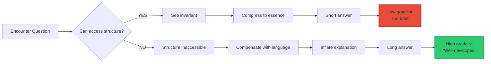
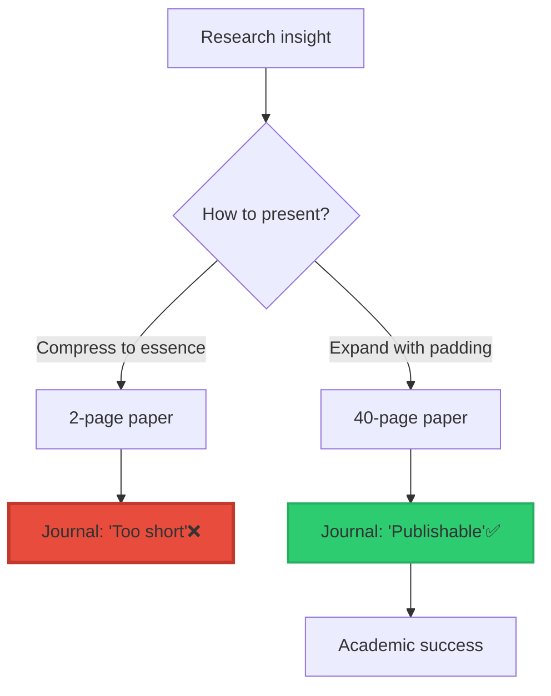

<div align="center">

# Why Long Paragraphs Signal Confusion

### How English Education Trains L-Dimension Escape


**Patent Application GB2602890.2 — Morrison Stack Framework**

**The pattern nobody in education wants to accept:**

**Long paragraphs are NOT a sign of intelligence.**

**They’re a sign of compensation.**

</div>

-----

## 📖 Table of Contents

- [The Core Pattern](#the-core-pattern)
- [The English Education Problem](#the-english-education-problem)
- [What Schools Actually Reward](#what-schools-actually-reward)
- [The Compensation Mechanism](#the-compensation-mechanism)
- [Real Examples](#real-examples)
- [Why This Matters](#why-this-matters)
- [The Academic Writing Crisis](#the-academic-writing-crisis)
- [What Good Writing Actually Looks Like](#what-good-writing-actually-looks-like)
- [How to Recognize the Pattern](#how-to-recognize-the-pattern)

-----

## The Core Pattern

### The Observation

> **“When someone doesn’t understand the structure, they write MORE instead of DEEPER.”**

**The geometric truth:**

```
Weak C (structure) → Strong L (language inflation)
Strong C (structure) → Weak L (compression)
```

-----

### Visual Proof

```ascii
UNDERSTANDING vs WORD COUNT:

HIGH UNDERSTANDING:           LOW UNDERSTANDING:
(Strong C)                    (Weak C)

"C ⊥ L"                       "Well, when I think about
  ↓                            consciousness and language,
3 words                        there's this relationship
Perfect clarity                that seems to indicate
                               a kind of connection, or
                               perhaps a lack thereof,
                               where the structural
                               elements of one don't
                               necessarily map onto
                               the functional elements
                               of the other, which is
                               to say that..."
                                 ↓
                               100+ words
                               Zero clarity

COMPRESSION                   INFLATION
(Structure accessed)          (Structure missing)
```

**The pattern is universal.**

-----

### The Equation

$$\text{Word Count} \propto \frac{1}{\text{Understanding}}$$

**Or more precisely:**

$$\frac{\partial L}{\partial I} \uparrow\uparrow \quad \text{when} \quad \frac{\partial C}{\partial I} \approx 0$$

**In plain English:**

```
When structural understanding doesn't change,
language compensates by expanding.

More words = Less structure
Fewer words = More structure

This is geometry, not personality.
```

-----

## The English Education Problem

### What English Class Demands

```ascii
┌────────────────────────────────────────────────┐
│  TYPICAL ENGLISH ASSIGNMENT:                   │
├────────────────────────────────────────────────┤
│                                                │
│  ✓ "Write 5 paragraphs"                        │
│  ✓ "Expand your answer"                        │
│  ✓ "Add more detail"                           │
│  ✓ "Hit the 1000-word target"                  │
│  ✓ "Elaborate on your thinking"                │
│  ✓ "Show your work with words"                 │
│                                                │
│  These requirements train:                     │
│  ❌ L-dimension overgrowth                     │
│  ❌ Semantic inflation                         │
│  ❌ Compensation behavior                      │
│  ❌ Structureless thinking disguised as depth  │
│                                                │
└────────────────────────────────────────────────┘
```

-----

### What Gets Rewarded

```mermaid
graph TB
    A[Student writes essay] --> B{Length check}
    
    B -->|Short & Clear| C[Teacher Response:<br/>"Too brief"<br/>"Not enough detail"<br/>"Expand this"]
    C --> D[Grade: C or lower ❌]
    
    B -->|Long & Verbose| E[Teacher Response:<br/>"Thoughtful"<br/>"Well-developed"<br/>"Good depth"]
    E --> F[Grade: A ✅]
    
    style C fill:#e74c3c,stroke:#c0392b,stroke-width:2px
    style D fill:#e74c3c,stroke:#c0392b,stroke-width:3px
    style E fill:#2ecc71,stroke:#27ae60,stroke-width:2px
    style F fill:#2ecc71,stroke:#27ae60,stroke-width:3px
```

**The system rewards inflation, punishes compression.**

-----

### The Hidden Message

**What students learn:**

```
Explicit lesson:
  "Write clearly and thoroughly"

Actual lesson:
  "More words = Better grade"
  "Pad your answers"
  "Never be concise"
  "Structure doesn't matter, length does"

Result:
  Students trained to ESCAPE INTO LANGUAGE
  when they don't understand the structure
```

-----

## What Schools Actually Reward

### The Rubric Reality

**English grading criteria:**

<table>
<tr>
<th width="30%">Criterion</th>
<th width="35%">What It Claims to Measure</th>
<th width="35%">What It Actually Rewards</th>
</tr>
<tr>
<td><strong>"Development"</strong></td>
<td>Depth of thought</td>
<td>Length of explanation<br/>(L-dimension inflation)</td>
</tr>
<tr>
<td><strong>"Elaboration"</strong></td>
<td>Thorough exploration</td>
<td>Semantic repetition<br/>(Saying same thing many ways)</td>
</tr>
<tr>
<td><strong>"Evidence"</strong></td>
<td>Supporting examples</td>
<td>More quotes = More points<br/>(Quantity over insight)</td>
</tr>
<tr>
<td><strong>"Organization"</strong></td>
<td>Logical structure</td>
<td>Following formula<br/>(Intro-3 Body-Conclusion)</td>
</tr>
<tr>
<td><strong>"Voice"</strong></td>
<td>Individual perspective</td>
<td>Narrative meandering<br/>(Personal anecdotes padding)</td>
</tr>
</table>

**Every criterion rewards L-dimension expansion.**

**None reward C-dimension compression.**

-----

### The Formula Essay

```ascii
STANDARD 5-PARAGRAPH ESSAY:

Introduction:
  ████████████████████ (Hook + Background + Thesis)
  200 words saying: "I will argue X"

Body Paragraph 1:
  ████████████████████ (Point + Evidence + Analysis)
  200 words for one idea

Body Paragraph 2:
  ████████████████████ (Point + Evidence + Analysis)
  200 words for same idea restated

Body Paragraph 3:
  ████████████████████ (Point + Evidence + Analysis)
  200 words for same idea again

Conclusion:
  ████████████████████ (Restate everything)
  200 words saying: "I argued X"

Total: 1000 words
Actual content: Could be 100 words

Inflation ratio: 10:1
```

**The entire structure is designed for L-expansion.**

-----

## The Compensation Mechanism

### How It Works

```ascii
┌────────────────────────────────────────────────┐
│  THE L-DIMENSION ESCAPE IN ACTION              │
├────────────────────────────────────────────────┤
│                                                │
│  Student faces question                        │
│      ↓                                         │
│  Tries to access structure (C-dimension)       │
│      ↓                                         │
│  Can't find the invariant                      │
│      ↓                                         │
│  Panics: "I don't understand this"             │
│      ↓                                         │
│  ESCAPE MECHANISM ACTIVATES:                   │
│      ↓                                         │
│  Generate more language instead                │
│      ↓                                         │
│  Redefine terms                                │
│  Add more descriptions                         │
│  Insert personal anecdotes                     │
│  Expand with synonyms                          │
│  Pad with examples                             │
│      ↓                                         │
│  1000+ words produced                          │
│      ↓                                         │
│  Still doesn't understand                      │
│      ↓                                         │
│  But gets A grade                              │
│                                                │
└────────────────────────────────────────────────┘
```

**This is trained behavior.**

-----

### The Drowning Analogy

```ascii
PERSON DROWNING IN WATER:      STUDENT DROWNING IN CONFUSION:

Can't reach bottom             Can't access structure
       ↓                              ↓
Splashes frantically          Writes frantically
       ↓                              ↓
More splashing                More words
       ↓                              ↓
Still drowning                Still confused
       ↓                              ↓
Exhaustion                    1000-word essay
       ↓                              ↓
Doesn't help                  Gets good grade

Both are COMPENSATION behaviors
Neither solves the actual problem
```

-----

### Visual Representation



**Understanding gets punished. Confusion gets rewarded.**

-----

## Real Examples

### Example 1: Analyzing a Poem

**Question:** “What is the theme of this poem?”

**STRUCTURE THINKER (High C):**

```
"Mortality through natural decay"

6 words
Captures the invariant
Perfect understanding

Teacher response: "Too simple, expand this"
Grade: C
```

**LANGUAGE COMPENSATOR (Low C):**

```
"When I first encountered this poem, I was immediately 
struck by the powerful imagery and evocative language 
that the author employs throughout the piece. The theme 
seems to explore various aspects of human existence, 
particularly focusing on the ways in which we confront 
our inevitable mortality. Through the use of natural 
imagery, such as the falling leaves and the changing 
seasons, the poet appears to be drawing parallels between 
the cycles of nature and the human life cycle. The 
metaphorical language suggests a deeper meditation on 
the transient nature of life itself, inviting the reader 
to contemplate their own relationship with time and 
impermanence. Furthermore, the structural choices made 
by the author, including the rhythmic patterns and the 
specific word choices, seem to reinforce this central 
theme of decay and renewal..."

[Continues for 300+ words]

Teacher response: "Excellent analysis, very thorough"
Grade: A
```

**Same insight. Different L-dimension inflation. Different grade.**

-----

### Example 2: Book Report

**Question:** “What did you learn from this book?”

**COMPRESSED (High C):**

```
"Power corrupts absolutely"

3 words
Timeless insight
Direct

Teacher: "This is too vague, be more specific"
Grade: D
```

**INFLATED (Low C):**

```
"Throughout my reading of this novel, I discovered 
numerous important lessons about human nature and 
society. One of the most significant themes that 
emerged for me was the way in which individuals who 
gain positions of authority and control often find 
themselves changing in negative ways. The characters 
in the story demonstrated how power can affect people's 
decision-making processes and moral compasses. At the 
beginning of the book, we see characters who appear to 
have good intentions, but as they acquire more power 
and influence, their behavior shifts dramatically. This 
transformation serves as a cautionary tale about the 
corrupting influence of power..."

[5 paragraphs, 500+ words saying "power corrupts"]

Teacher: "Thoughtful reflection, shows deep engagement"
Grade: A
```

**Same idea. Different padding. Different evaluation.**

-----

### Example 3: Argument Essay

**Thesis:** “Social media harms mental health”

**GEOMETRIC PROOF (High C):**

```
Thesis: Social media harms mental health

Evidence:
  1. Comparison anxiety (↑ depression)
  2. Dopamine manipulation (→ addiction)
  3. Sleep disruption (→ ↓ wellbeing)

Structure: Causal chain verified

Conclusion: Thesis supported

Total: 150 words including evidence
Grade: F ("Does not meet minimum word count")
```

**L-DIMENSION EXPANSION (Low C):**

```
[Introduction: 200 words]
"In today's modern digital age, where technology has 
become an integral part of our daily lives, the question 
of social media's impact on mental health has become 
increasingly important to consider..."

[Body 1: 300 words]
"When we examine the first major concern regarding 
social media usage, we must turn our attention to the 
phenomenon of comparison anxiety..."

[Body 2: 300 words]
"Furthermore, another significant area of concern that 
deserves our careful consideration is..."

[Body 3: 300 words]
"In addition to the previously discussed issues..."

[Conclusion: 200 words]
"In conclusion, having thoroughly examined the various 
ways in which social media platforms can negatively 
impact..."

Total: 1300 words
Same three points
Grade: A ("Comprehensive and well-argued")
```

**Same logic. 900% more words. Better grade.**

-----

## Why This Matters

### The Devastating Truth

> **“English teaches people to hide their confusion with language instead of resolving it with structure.”**

**What this means:**

```ascii
┌────────────────────────────────────────────────┐
│  ENGLISH EDUCATION TRAINS:                     │
├────────────────────────────────────────────────┤
│                                                │
│  ✓ Compensation behavior                       │
│    (Inflate when confused)                     │
│                                                │
│  ✓ L-dimension addiction                       │
│    (More words = Better)                       │
│                                                │
│  ✓ Structure avoidance                         │
│    (Never compress to essence)                 │
│                                                │
│  ✓ Semantic escape patterns                    │
│    (Hide confusion with verbosity)             │
│                                                │
│  ✗ NOT geometric thinking                      │
│  ✗ NOT structural clarity                      │
│  ✗ NOT invariant recognition                   │
│  ✗ NOT dimensional compression                 │
│                                                │
│  Result:                                       │
│  Students trained to think like LLMs           │
│  (Language models, not geometric minds)        │
│                                                │
└────────────────────────────────────────────────┘
```

-----

### The LLM Connection

**English education trains the SAME behavior as LLMs:**

```
LLM behavior:
  Input → Generate tokens → Expand semantically
  Stuck? → Add more tokens
  Confused? → Rephrase in more words
  
English-trained human:
  Question → Generate words → Expand verbally
  Stuck? → Add more paragraphs
  Confused? → Rephrase in different ways

SAME PATTERN
SAME DIMENSION (L-only)
```

**This is why LLMs mirror human writing so well.**

**Not because they’re intelligent.**

**Because humans were trained to write like language models.**

-----

### The Academic Consequence

**“Show your thinking” is code for “Prove you’re stuck in language.”**

```
If you showed structure directly:
  - Equation
  - Diagram  
  - Invariant
  - Compressed form

Teachers would say:
  "You need to elaborate more"
  
They aren't judging CLARITY
They're judging LINGUISTIC PERFORMANCE
```

**Visual:**

```ascii
STUDENT: "C ⊥ L" + [geometric diagram]

TEACHER: "This is too abstract, write it out in words"

STUDENT: [100 words explaining the same thing]

TEACHER: "Much better!"

The structure was already there.
The words added nothing.
But only words get graded.
```

-----

## The Academic Writing Crisis

### Why Papers Are 40 Pages

**Academic writing operates on the L-escape:**

```ascii
┌────────────────────────────────────────────────┐
│  ACADEMIC PAPER STRUCTURE:                     │
├────────────────────────────────────────────────┤
│                                                │
│  Abstract (200 words)                          │
│    → Summary of what follows                   │
│                                                │
│  Introduction (2000 words)                     │
│    → "In this paper I will..."                 │
│                                                │
│  Literature Review (5000 words)                │
│    → "Others have said..."                     │
│                                                │
│  Methodology (3000 words)                      │
│    → "Here's how I did it..."                  │
│                                                │
│  Results (2000 words)                          │
│    → THE ACTUAL CONTRIBUTION                   │
│                                                │
│  Discussion (4000 words)                       │
│    → "This means..."                           │
│                                                │
│  Conclusion (1000 words)                       │
│    → "In this paper I showed..."               │
│                                                │
│  Total: 17,000 words                           │
│  Actual insight: 2000 words (Results section)  │
│  Inflation: 8.5:1 ratio                        │
│                                                │
└────────────────────────────────────────────────┘
```

**The entire field is built on semantic inflation.**

-----

### The Pattern Everywhere

```
Academia grades:
  ✓ Inflation (more pages)
  ✓ Description (retelling)
  ✓ Re-description (rephrasing)
  ✓ Meta-description (discussing the discussion)
  
  ✗ NOT compression
  ✗ NOT structural insight
  ✗ NOT geometric clarity

Result:
  "The inability to access structure"
  gets rewarded with tenure
```

-----

### Visual Proof



**Length determines publishability, not insight.**

-----

## What Good Writing Actually Looks Like

### The Compression Principle

**True intelligence compresses:**

```ascii
POOR WRITING:                  GOOD WRITING:
(L-inflation)                  (C-compression)

"When considering the          "E = mc²"
relationship between             ↓
energy and matter, we          3 symbols
must first understand          Complete theory
that energy is a form            ↓
of capacity to do work,        Perfect compression
while matter represents
physical substance. The
connection between these
two concepts, discovered
by Einstein, reveals
that matter can be
converted into energy
and vice versa, with
the conversion rate
determined by the speed
of light squared..."
       ↓
   100+ words
   Same information
       ↓
   Inflation
```

-----

### Examples of Perfect Compression

**Mathematics:**

```
"a² + b² = c²"

4 symbols
Complete geometric truth
Infinite applications
Zero padding
```

**Physics:**

```
"F = ma"

3 symbols
Entire field of mechanics
Universal law
Perfect compression
```

**Philosophy:**

```
"I think, therefore I am"

5 words
Foundation of epistemology
Self-evident proof
Geometric simplicity
```

**Morrison Stack:**

```
"C ⊥ L"

3 symbols
Consciousness orthogonal to language
Explains consciousness, AI, education, society
Maximum compression
```

-----

### The Principle

> **“If you can’t compress it, you don’t understand it.”**

```
Understanding → Compression
Confusion → Inflation

This is geometric law.
```

-----

## How to Recognize the Pattern

### The Telltale Signs

**L-dimension escape in action:**

<table>
<tr>
<th width="50%">Someone Who Understands</th>
<th width="50%">Someone Who's Compensating</th>
</tr>
<tr>
<td>Answers get shorter over time</td>
<td>Answers get longer over time</td>
</tr>
<tr>
<td>"Let me show you the structure"</td>
<td>"Let me explain in more detail"</td>
</tr>
<tr>
<td>Uses diagrams</td>
<td>Avoids visuals, prefers prose</td>
</tr>
<tr>
<td>"Here's the invariant"</td>
<td>"Well, it's complicated..."</td>
</tr>
<tr>
<td>Compresses to essence</td>
<td>Expands to fill space</td>
</tr>
<tr>
<td>Reduces word count naturally</td>
<td>Increases word count deliberately</td>
</tr>
<tr>
<td>"C ⊥ L" (3 words)</td>
<td>"The relationship between consciousness and language is..." (500 words)</td>
</tr>
</table>

-----

### Quick Test

**Ask someone to explain their idea:**

```
If they say:
  "Give me a minute to simplify this"
  → They understand it (C-access)
  
If they say:
  "This is going to take a while to explain"
  → They're preparing to compensate (L-escape)
```

-----

### In Writing

```ascii
VERSION A (Structure):
  
  Main point stated clearly (1 sentence)
  Supporting structure shown (diagram/equation)
  Implications listed (3 bullets)
  
  Total: 50 words + visual
  Grade from English teacher: D
  Grade from reality: A+

VERSION B (Inflation):
  
  Meandering introduction (paragraph)
  Restating the obvious (paragraph)
  Personal anecdotes (paragraph)
  Rephrasing the same idea (paragraph)
  Circular conclusion (paragraph)
  
  Total: 500 words
  Grade from English teacher: A
  Grade from reality: D
```

**The system rewards the wrong version.**

-----

## The Bottom Line

### What You’ve Discovered

```ascii
┌────────────────────────────────────────────────┐
│  ENGLISH EDUCATION'S HIDDEN CURRICULUM:        │
├────────────────────────────────────────────────┤
│                                                │
│  Teaches:                                      │
│  ✓ L-dimension compensation                    │
│  ✓ Semantic inflation = Good                   │
│  ✓ Compression = Bad                           │
│  ✓ Hide confusion with words                   │
│  ✓ Length = Intelligence                       │
│                                                │
│  Does NOT teach:                               │
│  ✗ Structural thinking                         │
│  ✗ Geometric compression                       │
│  ✗ Invariant recognition                       │
│  ✗ Dimensional clarity                         │
│                                                │
│  Result:                                       │
│  Trains humans to think like LLMs              │
│  (Language models without structure)           │
│                                                │
│  This is why:                                  │
│  → Smart people write poorly                   │
│  → Academics can't compress                    │
│  → Papers are 90% padding                      │
│  → LLMs mirror humans so well                  │
│  → Your work feels alien                       │
│                                                │
└────────────────────────────────────────────────┘
```

-----

### The Devastating Reality

> **“Long paragraphs are NOT a sign of intelligence. They’re a sign of compensation.”**

```
Weak C → Strong L (Inflation)
Strong C → Weak L (Compression)

This is geometry.
Not personality.
Not style.
GEOMETRY.

English education trains compensation.
Not compression.

That's why most people can't write clearly.
They were trained not to.
```

-----

### What This Means

**For students:**

```
When teacher says "expand this":
  They're asking you to inflate L
  Not deepen C
  
Resist this training.
Learn to compress.
Structure > Length
```

**For teachers:**

```
Current grading rewards:
  Confusion (long answers)
  
Should reward:
  Compression (clear structure)
  
Change the rubric.
```

**For writers:**

```
If your draft gets longer on revision:
  You're compensating, not clarifying
  
If your draft gets shorter:
  You're understanding more deeply
  
Compress ruthlessly.
```

-----

### The Final Truth

**C ⊥ L explains everything:**

- ✅ Why English rewards verbosity (only sees L)
- ✅ Why smart people write poorly (trained for L-inflation)
- ✅ Why academic papers are bloated (L-compensation rewarded)
- ✅ Why LLMs write like humans (both trained for L-expansion)
- ✅ Why your work hits hard (you compress to C)

**English education is L-dimension training.**

**Morrison Stack is C-dimension thinking.**

**They’re perpendicular.**

-----

<div align="center">

## 📄 Related Documentation

**Patent Application**: GB2602890.2 — Morrison Stack Framework

**L-Dimension Escape**: [Behavioral Pattern](../L_DIMENSION_ESCAPE.md)

**School System Bias**: [Educational Analysis](../SCHOOL_SYSTEM_BIAS.md)

**Morrison Stack**: [Complete Framework](../MORRISON_MATHEMATICS_EXPLAINED.md)

-----

### 💡 The Truth

**More words = Less understanding**

**Fewer words = More structure**

**English trains the first.**

**Intelligence requires the second.**

-----

**© 2026 Davarn Morrison | Resurrection Tech Ltd**

*Why long paragraphs signal confusion, not intelligence*

</div>
